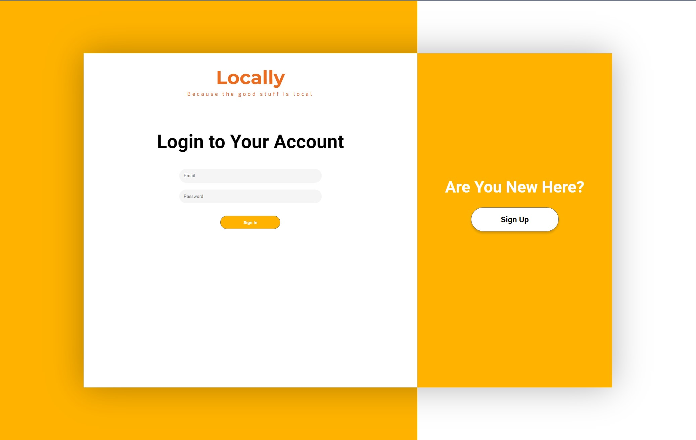
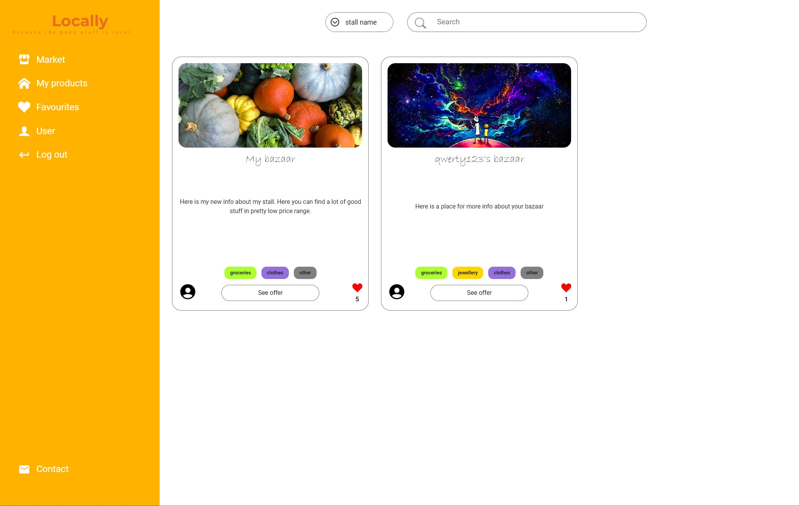
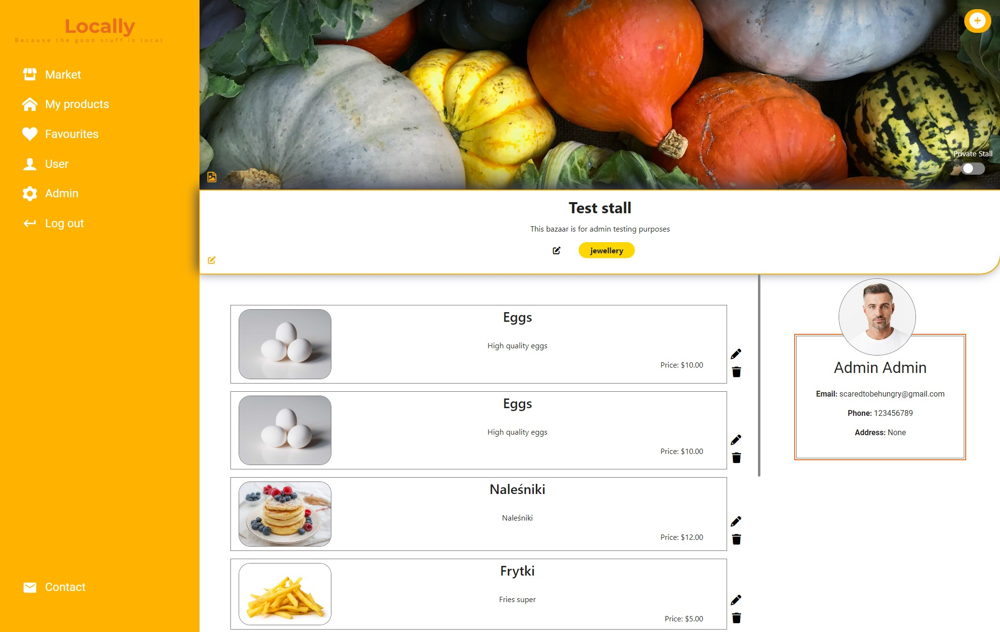

# Locally

> Live demo [_here_](https://www.example.com). <!-- If you have the project hosted somewhere, include the link here. -->

## Table of Contents
* [General Info](#general-information)
* [Technologies Used](#technologies-used)
* [Features](#features)
* [Screenshots](#screenshots)
* [Setup](#setup)
* [Project Status](#project-status)
* [Contact](#contact)


## General Information
- In this web app user can add offer with his own products. Products should be handmade or grown by the user (in case of groceries like potatoes, etc.). 
- App is created for farmers/artisan who want to promote and sell their products

## Technologies Used
- PHP
- Javascript
- HTML5
- CSS
- PostgreSQL


## Features
- User can add, delete and update his stall
- User can also add, delete and update his products
- Admin has a control panel where he can delete users and manage their stalls
- Search bar helps you faster find a stall you're looking for
- You can go to /favourites subpage to see only liked stalls

## Screenshots





## Setup
Clone the repository:
```git clone <https://wnajdek@bitbucket.org/wnajdek/projekt.git>```

Run with command:
```docker-compose build```
```docker-compose up```

Then open browser and in search bar type:
```localhost:8080```


## Project Status
Project is: _in progress_

## Contact
Created by Wojciech Najdek
